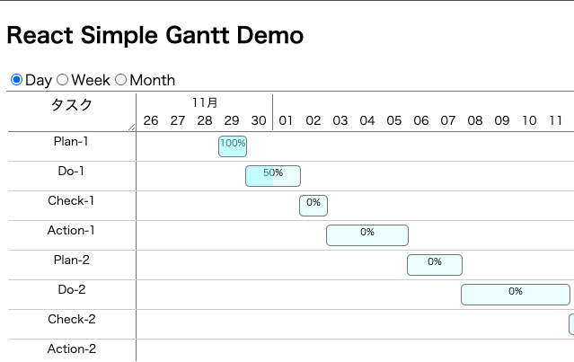

# React Simple Gantt

## Install

- yarn

```sh
yarn add react-simple-gantt
```

- npm

```sh
npm install --save react-simple-gantt
```

## Usage

### import

```jsx
import SimpleGantt from "react-simple-gantt";
```

### props

- tasks (required)
    - type: array
    
    Specify array of tasks.
    
    Task format is { id: string; name: string; start: string; end: string; progress: number }


- viewMode (optional)
    - type: string(Day|Week|Month)
    - Default: "Day"
    
    Can change view mode.
    
- onClick (optional)
    - type: function
    - Default: (task) => console.log(task)
    
     You can set action when click task name.
    
- height (optional)
    - Type: string
    - Default: "300px"
    
    Gantt chart height setting.
    
- headerWidth (optional)
    - Type: number
    - Default: 140
    
    Task name column width setting.

#### Example

```jsx
import React from "react"
import SimpleGantt from "react-simple-gantt";
...
      <SimpleGantt
        // required props
        tasks={
          [
            {
              id: "task1",
              name: "Plan-1",
              start: "2020-11-30T00:00:00",
              end: "2020-11-30T23:59:59",
              progress: 100,
            },
            {
              id: "task2",
              name: "Do-1",
              start: "2020-12-01T00:00:00",
              end: "2020-12-01T23:59:59",
              progress: 50,
            },
            ...
          ]
        }
        // optional props
        viewMode="Day" // Day|Week|Month
        onClick={(task) => console.log(task)}
        height="300px" // Default is 300px
        headerWidth={140} // Default is 140(px)
      />
```

## Demo

https://takuyatakada.github.io/react-simple-gantt/



## License

[MIT](LICENSE)